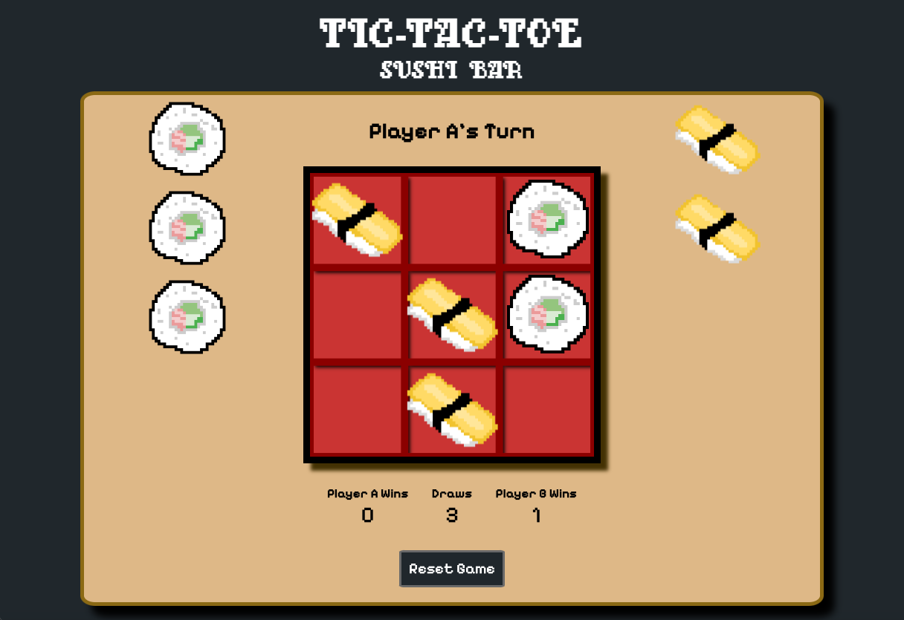
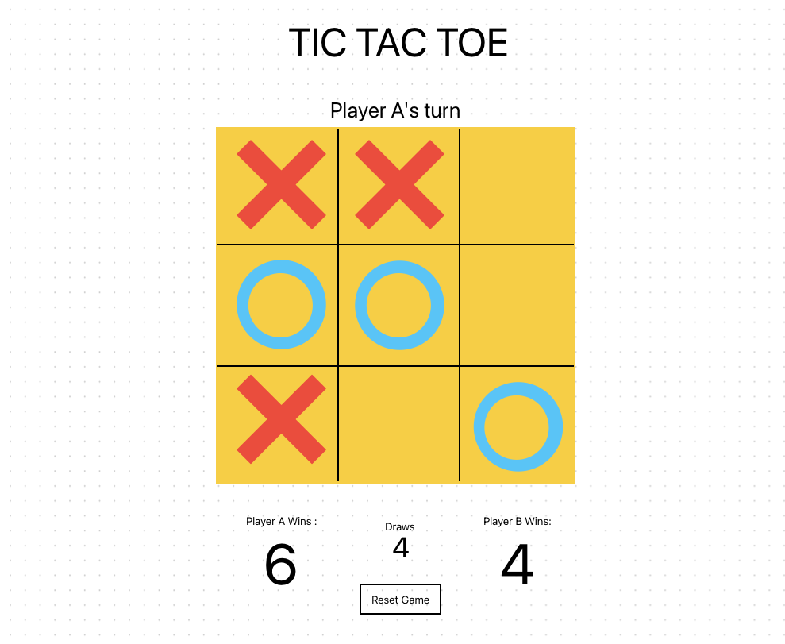
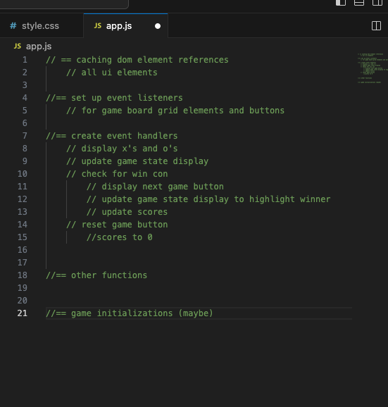
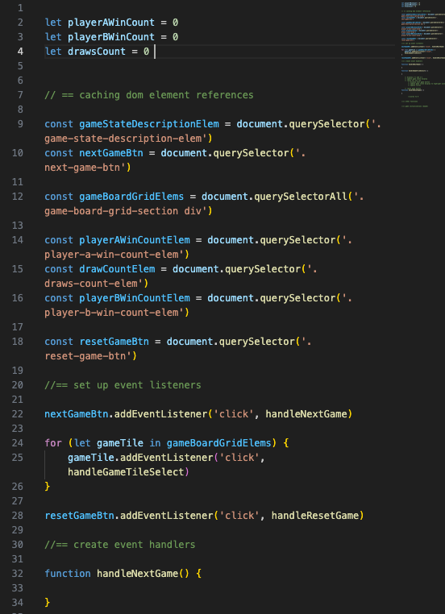
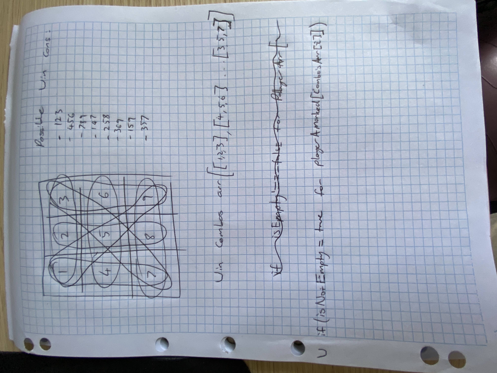

# TIC-TAC-TOE sushi-bar

TIC-TAC-TOE sushi-bar is a pixelated, retro-themed, tic-tac-toe, or 'naughts and crosses' simulator. It tracks your scores, so if you and your friends or family want to battle it out for hours on end... YOU CAN! Enjoy bringing it back to this old school PVP (player vs player) classic, in a relaxing digital sushi-bar 🍱. 

This project was part of the course requirments and my first project for my General Assembly Software Engineering Intensive course. 

## 🖥️ [Click here](https://scotthugs.github.io/tic-tac-toe/) to play!

## 📄 Getting Started

Once you have opened the app, click on the 'bento-box' game-board tiles to play your first move. The current player will be displayed above the game-board and the scores tracked below. 

The rules for tic-tac-toe:
- Players take turns putting their sushi pieces in empty squares. 
- The first player to get 3 of their sushi pieces in a row (up, down, across, or diagonally) is the winner. 
- When all 9 squares are full, the game is over.
- If no player has 3 sushi pieces in a row, it's a draw.

## ✏️ Planning & Problem Solving

To create this app I usesd a systematical aproach to stage out the project into the following steps. 
- planning, including quick wirframe diagrams using 'FreeForm' to get the general layout
      
- html skeleton structure creating relevent elements according to wireframe diagram
- quick css set up to get general layout with all element boarders set. 
- pseudocode in app.js to plan out general js logic
    
- start completeing pseudocode aiming for MVP 
    
- particualr thought required to consider how to test for win condition. Scribblings required...
    
- get MVP working, updating UI. 
- add css style to create theme
- fix bugs and add extra functionality including: correctly handling extra clicks, resting gameboard correctly, animations, sounds, tokens displayed for users to be removed as they play, highlighting winning tiles

## 🚀 Tech

- html
- css
- javascript
- google fonts
- Just-add-water CSS animations (https://animate.style/)
- pixabay audio files (https://pixabay.com/sound-effects)
- dinopixel to create images (https://dinopixel.com/)
- MyFontLib for player 3610 font (https://myfontlib.com/font/player-9-font)

## 😱 Bugs to fix

- Fix quickclicking audio elements to overlap or trigger after each other. (Currently same audio effect wont trigger over the top of itself.)
- Maybe fix grid back ground properly... 

## 😭 Lessons learnt

- Possibly correctly set up images in divs from the start for the game tile elements so that you can seperate the background of the tiles to the image of the tokens. 
- have a stronger theme plan from the start to eliminate time wasting. 

## ✅ Future features

- environemental game state animation to better show whos turn it is
- polish theme/style 
- create an AI to play single player 
- button to turn on and off relaxing background ambient noise 
- better audio bites 
